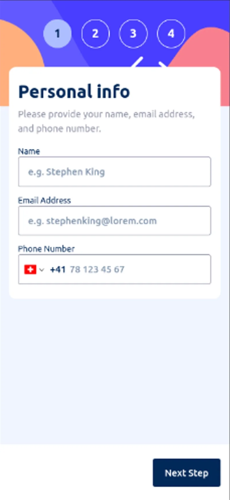
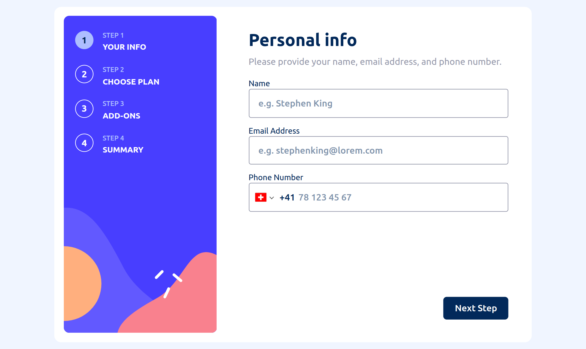

# Frontend Mentor - Multi-step form solution

This is a solution to the
[Multi-step form challenge on Frontend Mentor](https://www.frontendmentor.io/challenges/multistep-form-YVAnSdqQBJ).
Frontend Mentor challenges help you improve your coding skills by building
realistic projects.

## Table of contents

- [Overview](#overview)
  - [The challenge](#the-challenge)
  - [Screenshot](#screenshot)
  - [Links](#links)
- [My process](#my-process)
  - [Built with](#built-with)
  - [AI Collaboration](#ai-collaboration)
- [Getting Started](#getting-started)
  - [Prerequisites](#prerequisites)
  - [Development Build](#development-build)
  - [Production Build](#production-build)
- [Author](#author)

## Overview

### The challenge

Users should be able to:

- Complete each step of the sequence
- Go back to a previous step to update their selections
- See a summary of their selections on the final step and confirm their order
- View the optimal layout for the interface depending on their device's screen size
- See hover and focus states for all interactive elements on the page
- Receive form validation messages if:
  - A field has been missed
  - The email address is not formatted correctly
  - A step is submitted, but no selection has been made

### Screenshot

Target Build:

- General Overview
  

Solution Built:

- Mobile View:
  

- Desktop View:
  

### Links

- Solution URL: [GitHub Source Code](https://github.com/TonyFred-code/multi-step-form/)
- Live Site URL: [Vercel Deployed Demo](https://multi-step-form-omega-pied.vercel.app/)

## My process

### Built with

- Semantic HTML5 markup
- Mobile-first workflow
- [React](https://reactjs.org/) - JS library
- [TailwindCSS](https://tailwindcss.com/) - CSS framework
- [Vite](https://vite.dev/) - Build Tool

### AI Collaboration

Work with `Claude` as described in
[AGENTS Collaboration Specification](./CLAUDE.md) file

## Getting Started

### Prerequisites

Node.js (v20+ recommended)
Git

### Development Build

To run this project locally, follow these steps:

- Clone your fork of the repository:

```bash
git clone https://github.com/yourusername/multi-step-form.git
```

- Navigate to the project directory

```bash
cd multi-step-form
```

- Install dependencies

```bash
npm install
```

- Start the development server

```bash
npm run dev
```

The app will be available at: `http://localhost:5173`

### Production Build

```bash
npm run build
npm run preview
```

## Author

- Personal Website - [alfred.code](https://alfredfaith.me)
- Frontend Mentor - [@TonyFred-code](https://www.frontendmentor.io/profile/TonyFred-code)
- X (previously Twitter) - [@alfredfaith35](https://www.x.com/alfredfaith35)
